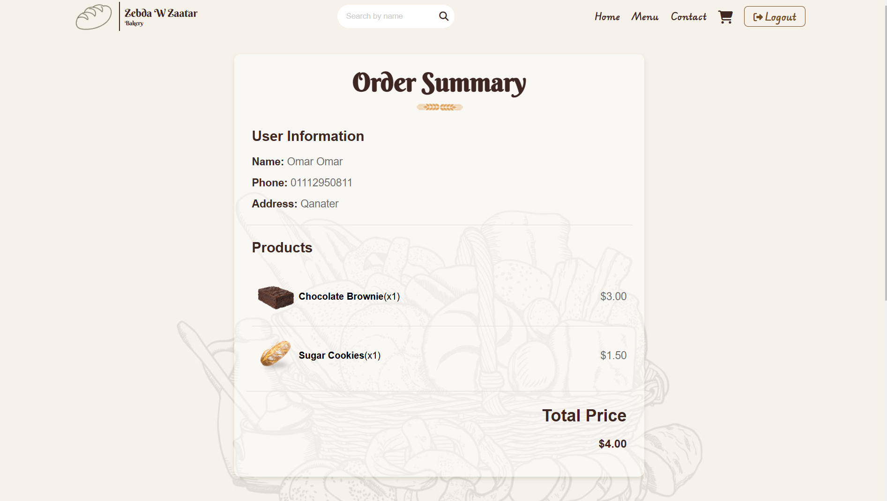

# Zebda w Zaatar

Zebda w Zaatar Bakery is a user-friendly bakery application where customers can browse, order, and enjoy a variety of delicious cakes, bread, and croissants. The app provides a seamless shopping experience, complete with cart management, secure payments, and a delightful interface.

## Table of Contents

- [Features](#features)
- [Technologies Used](#technologies-used)
- [Usage](#usage)
- [Screenshots](#screenshots)
- [Contact](#contact)

## Features

- **Customer Login**: Secure login for customers to access their accounts and manage orders
- **Browse Bakery Items**: Explore a variety of cakes, bread, and croissants with detailed descriptions and prices
- **Cart Management**: Add or remove items from the cart as needed, with real-time updates
- **Order Placement**: Easily place orders for selected items with a smooth checkout process
- **Payment Integration**: Pay securely through integrated payment options
- **Responsive Design**: Optimized for both desktop and mobile devices, ensuring a delightful user experience

## Technologies Used

- **Frontend**:HTML , CSS , JavaScript
- **Backend**: PHP and MYSQL

  
## Usage

- **Browse Menu**: Explore the delicious offerings of Zebda w Zaatar Bakery
- **Add to Cart**: Add your favorite items to the cart and manage quantities or remove them as needed
- **Place Order**: Checkout with ease and choose from available payment options
- **Enjoy**: Pick up your order or await delivery to indulge in the best baked goods

## Screenshots

Include some screenshots of my app to show the UI and its features.  

## Contact

If you have any questions or feedback, feel free to reach out:

- **Email**: omarmohamed8403@gmail.com
- **LinkedIn**: [Omar Mohamed](https://www.linkedin.com/in/omar-mohamed-611773292)
